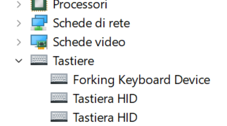

# How to install the double-keyboard driver (on Windows 10/11)

For now the driver is only available with my "signature". So the Windows system must accept this signature.

## Adding signature certificate
* First download the self-signed [certificate](./kbfiltr.cer), you can see it in [text](./kbfiltr.txt),
* Then make it part of the "Root certificates":
  Use PowerShell to invoke

```
Import-Certificate -FilePath ".\kbfiltr.cer" -CertStoreLocation cert:\CurrentUser\Root
```

It should be in as seen here:  

At this point the driver can be installed into the "DriverStore" .


https://learn.microsoft.com/en-us/windows-hardware/drivers/install/the-testsigning-boot-configuration-option

But to be **used**, loaded into the kernel, you also need (as admininstrator):
```
bcdedit /set testsigning on
```
This can be later undone, with "off", if you only want to test this driver, and return to safer mode.


### Update the PS/2 keyboard driver:

* download the driver -- 3 [files](double-keyboard.zip), unzip into a separate folder/directory,
* then "Update the driver" of your  ps/2 keyboard, by pointing to that directory.



A reboot is needed.


## In case of trouble see [recovery tools](windows-recovery.md)


### Configuration

use ./kbftest tool, to make scan-code "from", emit scancode "to" when pressed long/in
parallel with another key:

30 is "a", "42" is shift:

```
./kbftest 30 42
```

## Useful links:
https://github.com/lelegard/winkbdlayouts tools to install key-layouts, see 'scancodes'. Requires VS

I have created my rich key-layout [here](https://github.com/MichalMaruska/winkbdlayouts/commits/maruska/).

http://www.kbdedit.com/ -- a paid tool to create rich layouts. Extensive information.


* keymap
https://learn.microsoft.com/en-us/answers/questions/1239908/developed-a-keyboard-layout-dll-from-source-but-is
> I finally managed to find the solution by myself. I documented the explanations here: https://github.com/lelegard/winkbdlayouts#declaring-a-keyboard-layout-on-windows


### setup
- via dev-mng or CLI tool?


