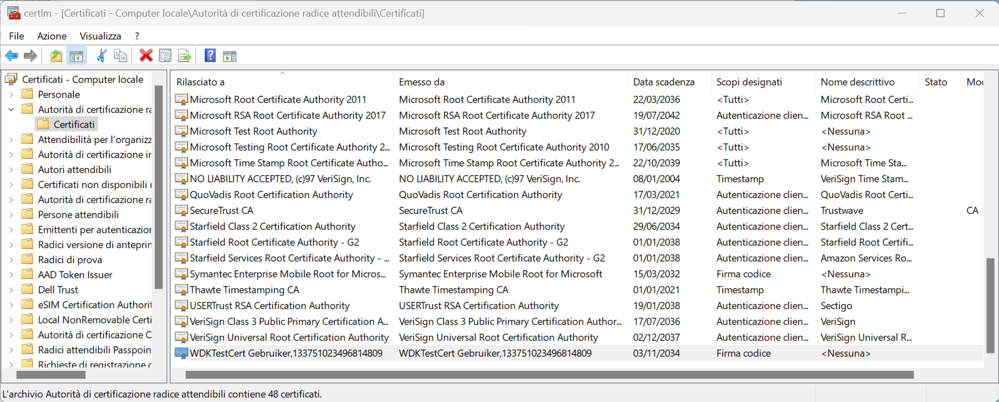

# How to develop the driver


## Using a provisioned PC (either kvm/qemu simulated or real)

well, Visual Studio has the "Deploy" function.

Using debugger?


## using a non-provisioned PC, which only does the minimum to install it

Always handy to have shared filesystem for quick transfer (in both directions). Samba...

follow [installation](windows-client-install.md)

### Certificate (once)
Use PowerShell to invoke

```
Import-Certificate -FilePath ".\kbfiltr.cer" -CertStoreLocation cert:\CurrentUser\Root
```

(maybe absolute path is necessary for the .cer file?)

And check in the certml tool that it's present (as one of Root certificates)



## Handy commands:
the path for the shared

Look at the log of driver installation/use at boot:
```
copy C:\Windows\inf\setupapi.dev.log \\server\share\
```


## preparing the release:

certificate in text vs binary:
```
openssl x509 -text        -in kbfiltr.cer -out kbfiltr.txt

openssl x509 -outform DER -in kbfiltr.txt   -out kbfiltr.der
```
